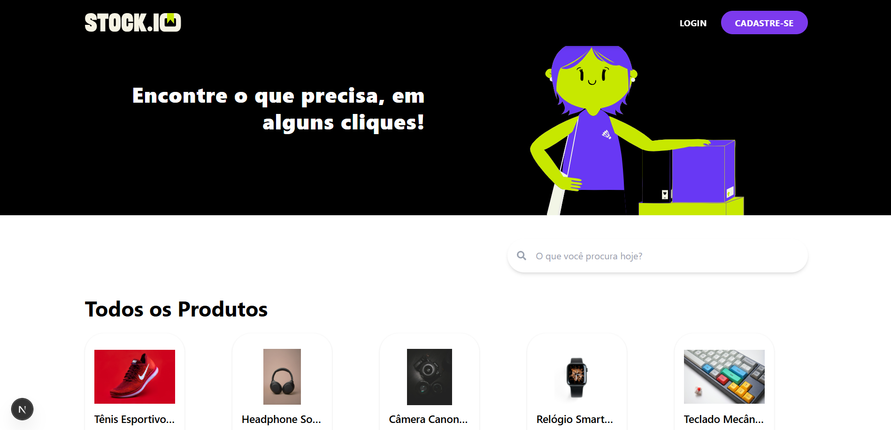
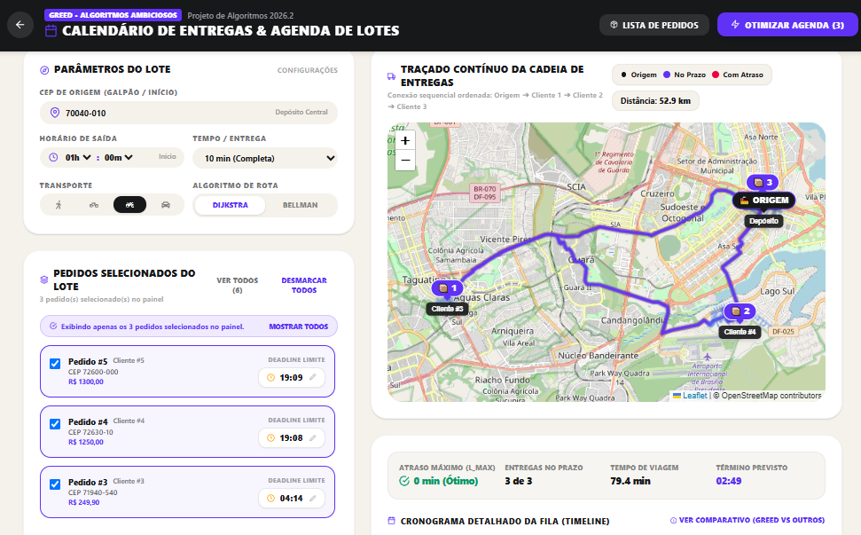
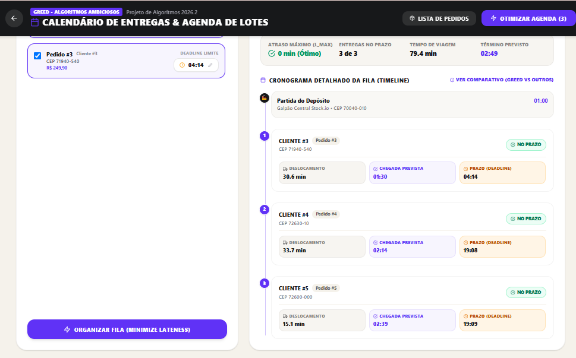
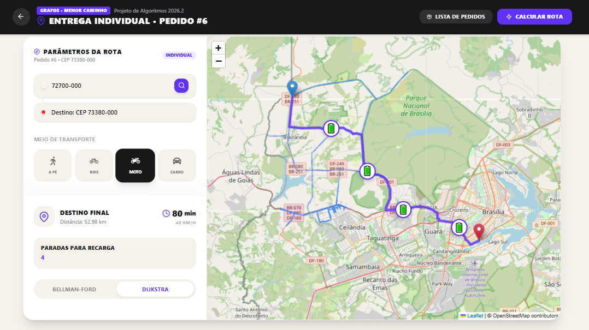
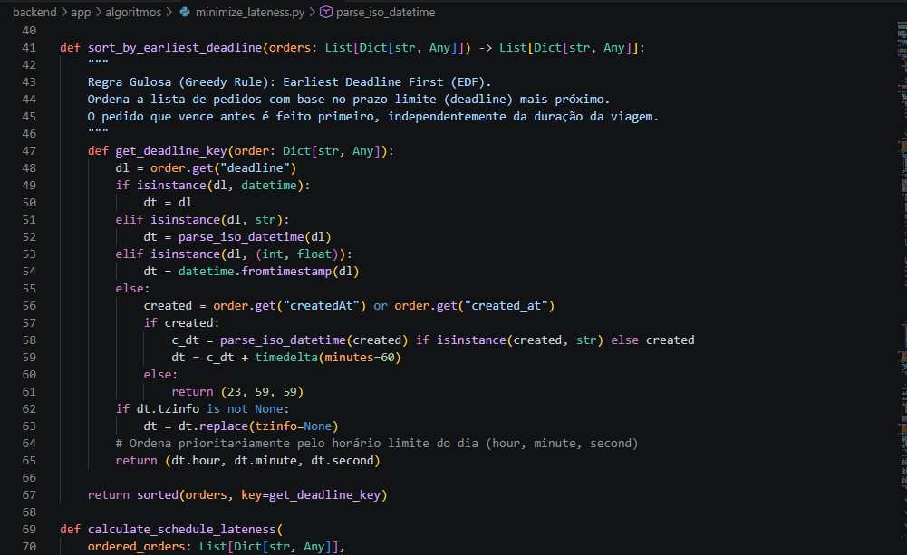
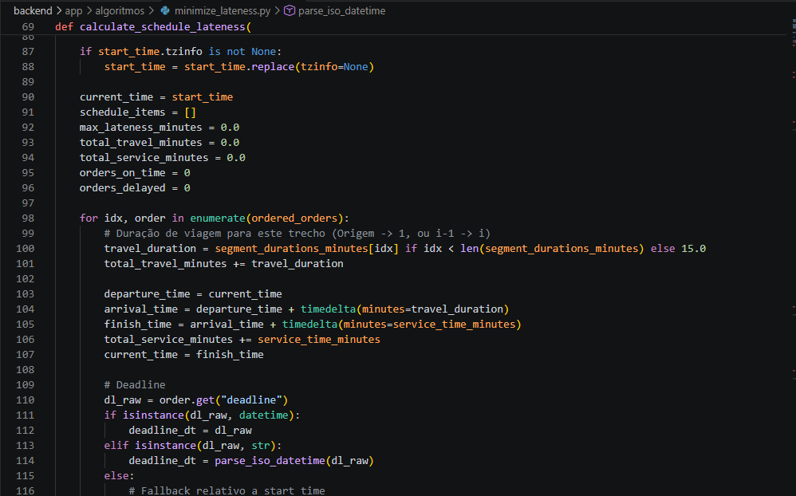
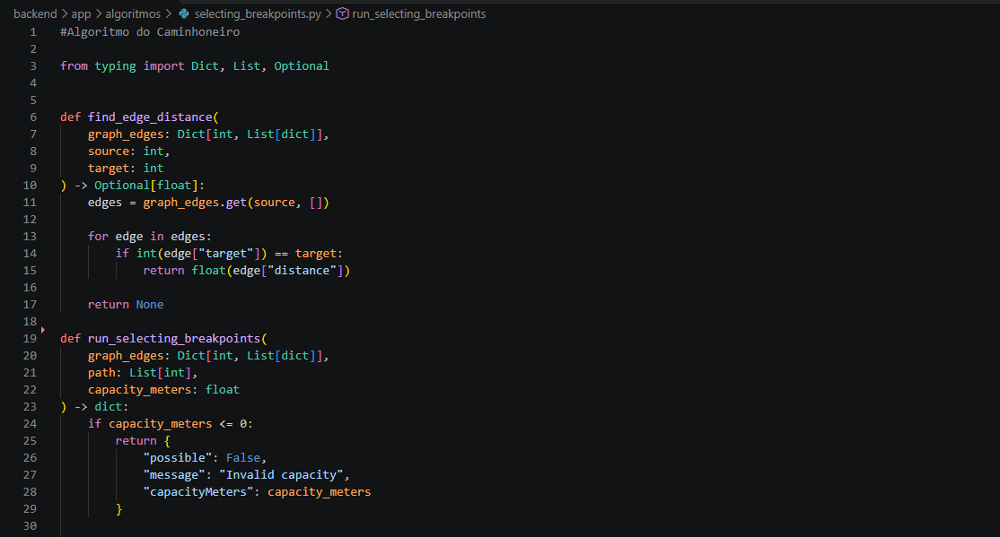
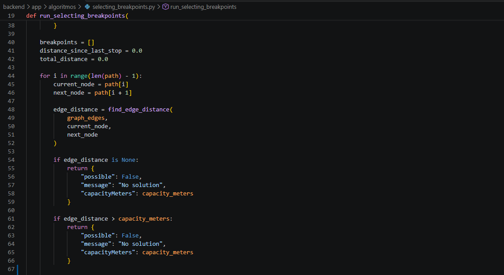
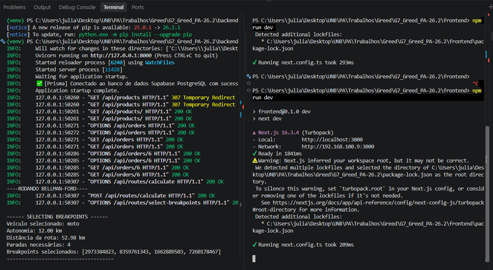

# Delivery Routing & Scheduling com Greed - Stock.io

Número da Lista: 2<br>
Conteúdo da Disciplina: Greed (Algoritmos Gulosos)<br>

## Alunos

| Foto | Nome | Matrícula |
| :---: | :--- | ---: |
|  | **Johnnatan Salles** | 241011330 |
|  | **Julia Gabriella** | 241036142 |

## Sobre

Este projeto foi desenvolvido para a disciplina de **Projeto de Algoritmos (PA) - 2026.2**, com foco na aplicação prática de **Algoritmos Ambiciosos (Greedy Algorithms)** em um cenário de logística e entregas.

A aplicação utiliza o ecossistema da plataforma **stock.io**, desenvolvido anteriormente, para representar problemas reais de roteamento e planejamento de entregas. Nesta segunda entrega foram implementadas duas aplicações de algoritmos gulosos:

- **Scheduling to Minimize Lateness**, utilizado para organizar um lote de pedidos de acordo com seus prazos de entrega;
- **Selecting Breakpoints**, adaptado como **Algoritmo do Caminhoneiro**, utilizado para determinar os pontos de recarga necessários durante uma rota individual de acordo com a autonomia do veículo.

Os algoritmos de caminho mínimo desenvolvidos na entrega anterior, como **Dijkstra** e **Bellman-Ford**, continuam sendo utilizados como suporte para obtenção das rotas. A partir dessas rotas, os algoritmos gulosos tomam suas decisões de agendamento ou seleção de pontos de parada.

---

## Screenshots



*Figura 1: Tela inicial da plataforma Stock.io.*



*Figura 2: Calendário de entregas com lote de pedidos organizado pelo Minimize Lateness e rota contínua entre os clientes.*



*Figura 3: Timeline detalhada da fila de entregas, exibindo deslocamento, horário previsto de chegada e deadline de cada pedido.*



*Figura 4: Rota individual com os pontos de recarga selecionados pelo algoritmo Selecting Breakpoints.*



*Figura 5: Implementação da regra gulosa Earliest Deadline First utilizada pelo Minimize Lateness.*



*Figura 6: Cálculo do cronograma, horários de chegada e atrasos dos pedidos.*



*Figura 7: Estrutura inicial da implementação do Selecting Breakpoints e validação da autonomia do veículo.*



*Figura 8: Percurso da rota e verificação dos trechos realizada pelo Algoritmo do Caminhoneiro.*



*Figura 9: Frontend e backend em execução.*

---

## Tecnologias Utilizadas

O projeto está dividido em duas partes principais:

### Frontend

- **Framework:** Next.js com React
- **Linguagem:** TypeScript
- **Estilização:** TailwindCSS
- **Mapas:** Leaflet
- **Geocodificação:** ViaCEP + OpenStreetMap/Nominatim
- **Malha viária:** OpenStreetMap / Overpass API

### Backend

- **Framework:** FastAPI
- **Linguagem:** Python 3.11+
- **ORM:** Prisma
- **Banco de Dados:** PostgreSQL / Supabase
- **Algoritmos:** Minimize Lateness, Selecting Breakpoints, Dijkstra e Bellman-Ford

---

## Funcionalidades e Algoritmos

### 1. Minimize Lateness

O primeiro algoritmo guloso implementado foi o **Scheduling to Minimize Lateness**, utilizado no contexto de múltiplas entregas.

O objetivo é organizar a fila de pedidos de forma que o maior atraso entre todas as entregas seja o menor possível.

#### Regra Gulosa

Foi utilizada a estratégia **Earliest Deadline First (EDF)**.

Os pedidos são ordenados de forma crescente pelo prazo de entrega:

$$
d_1 \leq d_2 \leq \dots \leq d_n
$$

Assim, o pedido cujo prazo termina primeiro é atendido primeiro.

A escolha é feita independentemente da duração individual do deslocamento, priorizando sempre o deadline mais próximo.

#### Cálculo do atraso

Para cada pedido:

- $t_i$: tempo necessário para deslocamento/atendimento;
- $d_i$: prazo limite da entrega;
- $f_i$: instante de término da entrega;
- $l_i$: atraso da entrega.

O atraso individual é calculado por:

$$
l_i = \max(0, f_i - d_i)
$$

E o atraso máximo do lote é:

$$
L_{\max} = \max_i l_i
$$

A estratégia EDF minimiza o valor de $L_{\max}$.

#### Complexidade

A principal operação é a ordenação dos pedidos por deadline:

$$
O(n \log n)
$$

Após a ordenação, o cálculo do cronograma percorre os pedidos linearmente.

---

### 2. Rota Contínua do Lote

Depois da ordenação produzida pelo Minimize Lateness, os pedidos são conectados seguindo exatamente a sequência definida pelo algoritmo:

$$
\text{Origem}
\rightarrow
\text{Cliente 1}
\rightarrow
\text{Cliente 2}
\rightarrow
\dots
\rightarrow
\text{Cliente N}
$$

Para cada trecho consecutivo, é utilizado um algoritmo de menor caminho, como **Dijkstra** ou **Bellman-Ford**.

O sistema calcula:

- distância de cada trecho;
- tempo estimado de deslocamento;
- horário previsto de chegada;
- deadline;
- atraso individual;
- atraso máximo do lote.

A sequência também é representada visualmente no mapa por uma rota contínua e marcadores numerados.

---

### 3. Selecting Breakpoints - Algoritmo do Caminhoneiro

O segundo algoritmo guloso implementado foi o **Selecting Breakpoints**, adaptado para o problema de autonomia de veículos durante uma entrega individual.

Nesse cenário, primeiro é calculada uma rota entre a origem e o destino. O algoritmo recebe:

- o caminho já calculado;
- as distâncias entre os nós do caminho;
- a autonomia máxima do veículo.

A partir dessas informações, o objetivo é selecionar os pontos em que o veículo deverá realizar uma recarga.

#### Regra Gulosa

A decisão adotada é:

> **Percorrer a maior distância possível antes de realizar uma nova parada.**

Durante o percurso, o algoritmo acumula a distância percorrida desde a última recarga.

Antes de avançar para o próximo trecho, é verificado se:

$$
distância\_acumulada + próxima\_aresta > autonomia
$$

Caso a condição seja verdadeira, o nó atual é selecionado como um **breakpoint**.

Esse nó representa o último ponto alcançável antes de ultrapassar a capacidade disponível.

Após a recarga, a distância acumulada é reiniciada e o algoritmo continua percorrendo a rota.

#### Exemplo

Considerando:

```text
Autonomia do veículo: 2 km

Origem ---- Nó A ---- Nó B ---- Nó C ---- Destino
```

O algoritmo tenta avançar continuamente enquanto a autonomia permite.

Quando percebe que não consegue alcançar o próximo trecho sem ultrapassar os 2 km disponíveis, seleciona o nó atual como ponto de recarga.

Assim:

```text
Origem ---- Nó A ---- 🔋 ---- Nó C ---- 🔋 ---- Destino
```

#### Condição sem solução

Também é verificado se uma única aresta possui distância maior que toda a autonomia do veículo.

Por exemplo:

```text
Autonomia: 2 km
Trecho entre dois nós: 3 km
```

Nesse caso, mesmo iniciando o trecho com carga completa, o veículo não conseguiria alcançar o próximo nó.

O algoritmo então retorna:

```text
No solution
```

#### Resultado

Ao final da execução são retornados:

- possibilidade de completar a rota;
- lista dos breakpoints escolhidos;
- quantidade de paradas necessárias;
- distância total da rota;
- autonomia utilizada.

Os breakpoints retornados são identificadores dos nós do grafo. A interface utiliza esses identificadores para recuperar suas coordenadas e posicionar os marcadores de bateria no mapa.

Além da visualização no mapa, o backend registra no terminal informações como:

```text
SELECTING BREAKPOINTS

Veículo selecionado: moto
Autonomia: 12.00 km
Distância da rota: 52.98 km
Paradas necessárias: 4
Breakpoints selecionados: [...]
```

Isso permite acompanhar diretamente a entrada utilizada pelo algoritmo e o resultado da decisão gulosa.

---

## Comparativo Teórico de Estratégias

### Minimize Lateness

Para demonstrar o comportamento da estratégia gulosa, o sistema permite comparar o **Earliest Deadline First** com outras formas de organização.

| Estratégia | Regra de Ordenação | Atraso Máximo | Optimalidade |
| :--- | :--- | :--- | :--- |
| **Minimize Lateness (EDF)** | Menor deadline primeiro | **Mínimo possível** | **Ótima** |
| **FIFO** | Ordem de chegada/criação | Pode produzir atrasos maiores | Não garante optimalidade |
| **SPT** | Menor tempo de processamento primeiro | Pode adiar pedidos urgentes | Não garante optimalidade |

O EDF prioriza sempre o pedido cujo prazo termina primeiro, sendo a estratégia adequada para minimizar o atraso máximo.

### Selecting Breakpoints

No Selecting Breakpoints, a escolha gulosa consiste em selecionar sempre o **ponto mais distante que ainda pode ser alcançado com a autonomia disponível**.

Em uma rota fixa, considerando os nós da rota como possíveis pontos de recarga, essa decisão evita paradas antecipadas desnecessárias e reduz a quantidade de paradas necessárias durante o percurso.

---

## Instalação

### 1. Clonando o repositório

```bash
git clone https://github.com/projeto-de-algoritmos-2026/G7_Greed_PA-26.2.git
cd G7_Greed_PA-26.2
```

### 2. Configurando o Backend

Abra um terminal e navegue até a pasta `backend`:

```bash
cd backend
```

#### Crie e ative o ambiente virtual

Windows:

```bash
python -m venv venv
.\venv\Scripts\activate
```

Linux/Mac:

```bash
python3 -m venv venv
source venv/bin/activate
```

#### Instale as dependências

```bash
pip install -r requirements.txt
```

#### Configure o Prisma

```bash
prisma py fetch
prisma generate
prisma db push
```

#### Inicie o backend

```bash
python -m uvicorn app.main:app --reload --port 8000
```

A API estará disponível em:

```text
http://localhost:8000
```

A documentação interativa poderá ser acessada em:

```text
http://localhost:8000/docs
```

### 3. Configurando o Frontend

Abra outro terminal e navegue até a pasta `frontend`:

```bash
cd frontend
```

Instale as dependências:

```bash
npm install
```

Inicie o servidor:

```bash
npm run dev
```

A aplicação estará disponível em:

```text
http://localhost:3000
```

---

## Uso

### Credenciais de Acesso para Testes

#### Cliente

- **Email:** mauricio@gmail.com
- **Senha:** mauricio123@

#### Entregador

- **Email:** mauricioentregador@gmail.com
- **Senha:** mauricio123@

---

### Minimize Lateness

1. Faça login como **entregador**.
2. Acesse o **Calendário de Entregas & Agenda de Lotes**.
3. Informe o CEP de origem.
4. Selecione o meio de transporte.
5. Selecione os pedidos que deverão fazer parte do lote.
6. Defina ou altere os deadlines dos pedidos, caso desejado.
7. Clique em **Organizar Fila (Minimize Lateness)**.
8. O sistema irá ordenar os pedidos pela regra EDF.
9. A rota contínua será traçada no mapa seguindo a ordem calculada.
10. A timeline exibirá os horários previstos, deadlines e possíveis atrasos.

Também é possível acessar o comparativo entre a estratégia gulosa e outras estratégias de ordenação.

---

### Selecting Breakpoints

1. Faça login como **entregador**.
2. Acesse a lista de pedidos.
3. Escolha uma **entrega individual**.
4. Informe o CEP de origem.
5. Escolha o meio de transporte.
6. Escolha o algoritmo de rota entre **Dijkstra** e **Bellman-Ford**.
7. Clique em **Calcular Rota**.
8. O sistema calcula inicialmente o caminho entre origem e destino.
9. O Selecting Breakpoints analisa o caminho utilizando a autonomia definida para o veículo.
10. Os pontos escolhidos para recarga são exibidos no mapa através de marcadores de bateria.
11. A interface também informa a quantidade total de paradas para recarga.

---

## Outros

### Vídeo da apresentação

[](https://youtu.be/GatoWrMUynk)
